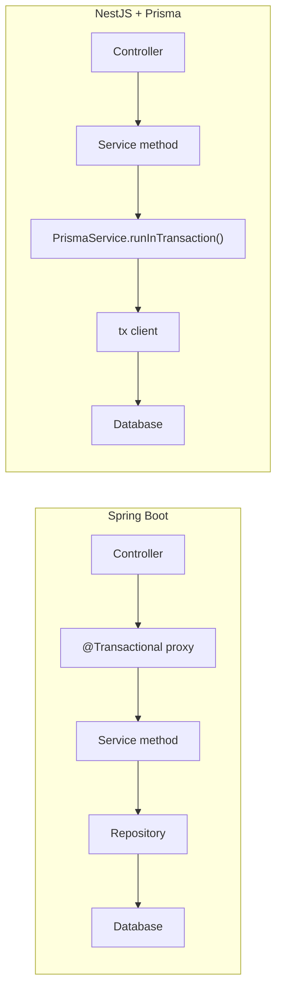
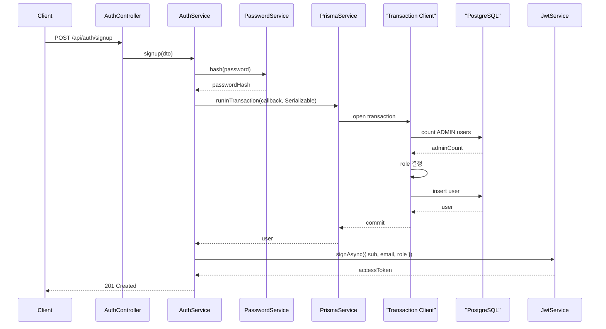
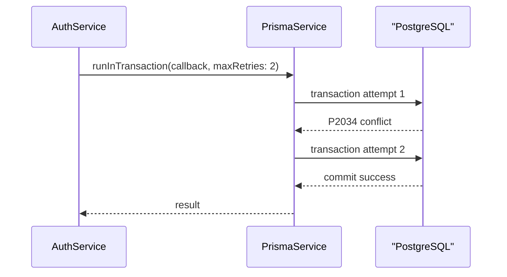

# NestJS Prisma Transactions

이 문서는 Spring Boot의 `@Transactional`에 익숙한 관점에서 NestJS + Prisma의 transaction boundary를 이해하기 위해 정리한다.

## Big Picture

Spring Boot에서는 보통 service method에 `@Transactional`을 붙이면 Spring AOP proxy가 method 실행 전후로 transaction을 열고 닫는다.

NestJS + Prisma에서는 NestJS framework가 transaction annotation을 기본 제공하지 않는다. 대신 service code에서 Prisma transaction API를 명시적으로 호출한다.



핵심 차이는 다음과 같다.

| 주제 | Spring Boot | NestJS + Prisma sample |
| --- | --- | --- |
| transaction 시작 | `@Transactional` proxy | `PrismaService.runInTransaction()` 명시 호출 |
| DB 작업 객체 | 같은 transaction에 묶인 repository/entity manager | callback으로 받은 `tx` client |
| isolation 설정 | `@Transactional(isolation = ...)` | `Prisma.TransactionIsolationLevel` |
| retry | 보통 별도 retry 정책 필요 | helper의 `maxRetries`로 `P2034` conflict 재시도 |
| propagation | Spring transaction propagation 제공 | 이 샘플에서는 구현하지 않음 |

## Two Prisma Transaction Styles

Prisma에는 자주 쓰는 transaction 방식이 두 가지 있다.

### Sequential Operations

독립적인 Prisma query 여러 개를 한 transaction으로 묶을 때 사용한다.

```ts
const [items, total] = await prisma.$transaction([
  prisma.user.findMany({ where, orderBy, skip, take }),
  prisma.user.count({ where }),
]);
```

이 샘플에서는 `UsersService.findAll()`이 이 방식을 사용한다. `findMany`와 `count` 사이에 branch logic이 없고, 두 query를 같은 시점의 일관된 읽기로 묶는 목적이기 때문이다.

### Interactive Transaction

앞 query 결과에 따라 다음 query가 달라질 때 사용한다.

```ts
await prisma.$transaction(async (tx) => {
  const adminCount = await tx.user.count({ where: { role: Role.ADMIN } });
  const role = adminCount === 0 ? Role.ADMIN : Role.USER;

  return tx.user.create({
    data: { email, passwordHash, role },
  });
});
```

이 샘플에서는 `AuthService.signup()`이 이 방식을 사용한다. `ADMIN` 사용자가 없으면 첫 가입자를 `ADMIN`으로 만들고, 이미 있으면 `USER`로 만들어야 하므로 `count -> role 결정 -> create`가 하나의 transaction boundary 안에 있어야 한다.

## Sample Implementation

`PrismaService`는 Prisma Client를 NestJS provider로 감싸면서 transaction helper도 제공한다.

```ts
await this.prisma.runInTransaction(
  async (tx) => {
    const role = await this.resolveSignupRole(tx);

    return tx.user.create({
      data: {
        email: dto.email,
        name: dto.name,
        passwordHash,
        role,
      },
    });
  },
  {
    isolationLevel: Prisma.TransactionIsolationLevel.Serializable,
    maxRetries: 2,
  },
);
```

`Serializable`을 사용하는 이유는 동시에 두 명이 처음 가입할 때 둘 다 `ADMIN`으로 판단하는 race condition을 줄이기 위해서다. 충돌이 나면 Prisma가 `P2034`를 던질 수 있고, helper는 `maxRetries` 횟수만큼 transaction callback을 다시 실행한다.

## Signup Flow



충돌이 발생하면 흐름은 다음처럼 바뀐다.



## Rules Of Thumb

- transaction callback 안에서는 반드시 callback parameter로 받은 `tx`를 사용한다.
- transaction 안에서 외부 HTTP 호출, 긴 CPU 작업, 파일 작업처럼 오래 걸리는 작업은 피한다.
- password hashing처럼 DB transaction과 직접 관련 없는 작업은 transaction 밖에서 먼저 처리한다.
- retry가 켜진 transaction callback은 다시 실행될 수 있으므로 side effect를 넣지 않는다.
- 단순히 여러 독립 query를 묶는 경우는 array transaction을 사용한다.
- 앞 query 결과로 다음 query가 달라지는 경우는 interactive transaction을 사용한다.

이 샘플은 Spring의 `@Transactional` 전체 기능을 복제하지 않는다. propagation, read-only transaction, nested transaction, savepoint 같은 주제는 아직 다루지 않고, service layer에서 transaction boundary를 명시적으로 잡는 방법에 집중한다.
