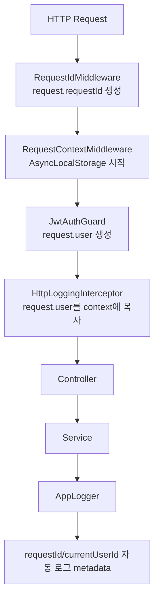

# NestJS Request Context

이 문서는 Spring의 `ThreadLocal`, `MDC`, `SecurityContextHolder`, `RequestContextHolder`와 비교해서 이 샘플의 request context 구조를 설명한다.

## Why

HTTP 요청 하나에는 여러 공통 정보가 붙는다.

```text
requestId
currentUserId
currentUserRole
method
path
```

controller, service, logger, audit helper에 이 값을 계속 파라미터로 넘기면 코드가 쉽게 지저분해진다. 이 샘플은 Node의 `AsyncLocalStorage`로 요청 단위 context를 만들고, logger가 이 context를 자동으로 읽게 한다.

## Flow



핵심은 `RequestContextMiddleware`가 요청 처리 async chain을 감싼다는 점이다. 이후 같은 요청 안에서 실행되는 controller, service, logger는 `RequestContextService`를 통해 현재 요청 정보를 읽을 수 있다.

## Spring Comparison

| Spring Boot | NestJS sample | 역할 |
| --- | --- | --- |
| `HttpServletRequest#setAttribute` | `request.requestId`, `request.user` | request 객체에 값 저장 |
| `ThreadLocal` | `AsyncLocalStorage` | 현재 실행 흐름의 context 보관 |
| `MDC` | `AppLogger` + `RequestContextService` | 로그에 request metadata 자동 포함 |
| `SecurityContextHolder` | `request.user` + request context | 인증 사용자 정보 보관 |
| `RequestContextHolder` | `RequestContextService` | service/logger에서 요청 정보 접근 |

Java/Spring은 요청을 처리하는 thread 기준으로 context를 보관하는 경우가 많다. Node/NestJS는 `async/await`, Promise, event loop를 따라 실행되므로 thread가 아니라 async execution chain 기준으로 context를 보관한다.

```text
Spring ThreadLocal
-> thread 기준 context

Node AsyncLocalStorage
-> async execution chain 기준 context
```

## Current Implementation

구현 파일은 다음과 같다.

```text
src/common/request-context/request-context.module.ts
src/common/request-context/request-context.middleware.ts
src/common/request-context/request-context.service.ts
```

요청 시작 시 middleware가 context를 만든다.

```ts
this.requestContext.run(
  {
    requestId: getRequestId(request),
    method: request.method,
    path: request.originalUrl || request.url,
  },
  () => next(),
);
```

인증이 필요한 요청은 guard 이후 `request.user`가 생긴다. `HttpLoggingInterceptor`는 controller를 호출하기 전에 이 값을 context에 복사한다.

```ts
this.requestContext.setCurrentUser(request.user);
```

`AppLogger`는 로그를 쓸 때 context metadata를 자동으로 합친다.

```ts
{
  requestId: "...",
  currentUserId: "...",
  currentUserRole: "ADMIN"
}
```

그래서 service 안에서 다음처럼 로그만 남겨도 request metadata가 같이 기록된다.

```ts
this.logger.info('User updated', { userId: targetUserId }, 'UsersService');
```

## Boundary Rule

Request Context는 비즈니스 입력값을 숨기기 위한 도구가 아니다.

명시적으로 넘기는 편이 좋은 값:

```ts
this.usersService.updateUser(targetUserId, dto, currentUser);
```

context가 어울리는 값:

```text
requestId
traceId
currentUserId for logging
currentUserRole for logging
audit metadata
```

즉 이 샘플에서 Request Context의 목적은 다음이다.

```text
비즈니스 규칙을 숨기지 않는다.
요청 추적, 로깅, 감사 정보를 편하게 전파한다.
Service가 Express request 객체에 직접 의존하지 않게 한다.
```
