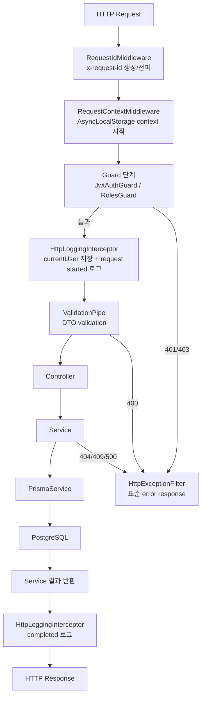
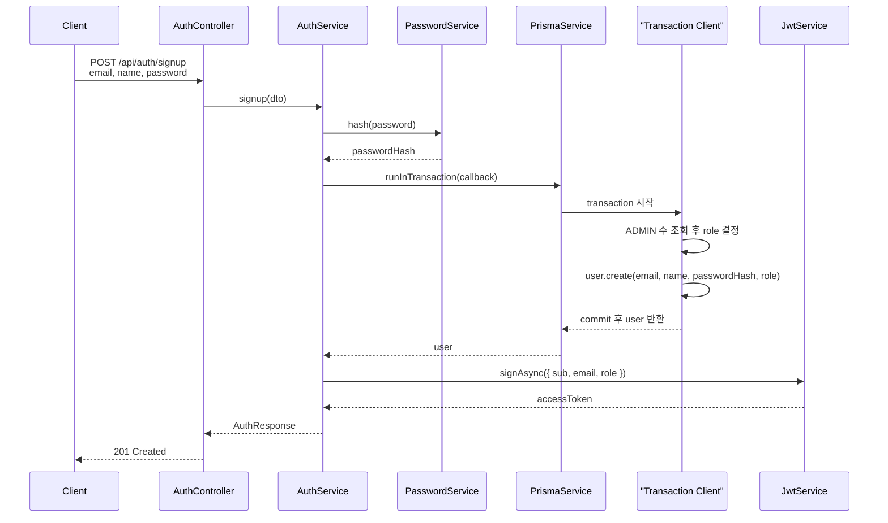
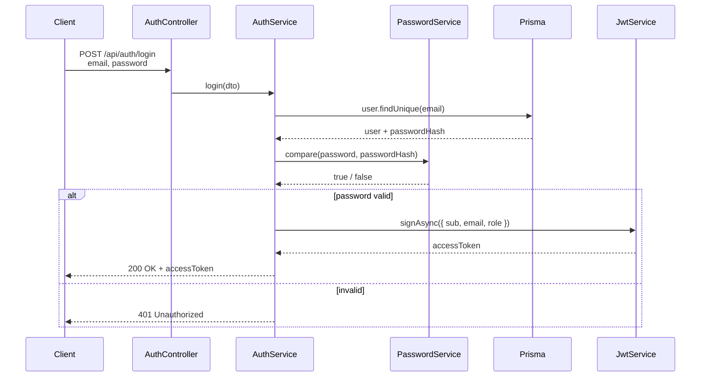
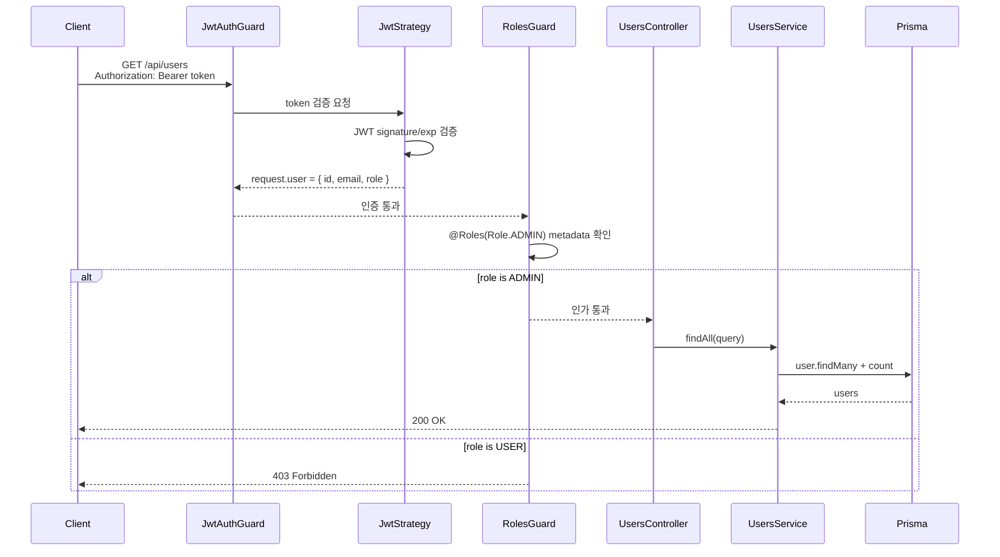

# NestJS Request Lifecycle

이 문서는 이 샘플에서 HTTP 요청이 어떤 순서로 처리되는지 정리한다. Spring MVC/Security의 `Filter`, `HandlerInterceptor`, `@Valid`, `@ControllerAdvice`, `SecurityContext` 흐름과 비교해서 이해하는 것을 목표로 한다.

## Overall Flow

현재 샘플의 HTTP 요청은 대략 다음 흐름을 지난다.



실행 순서를 텍스트로 쓰면 다음과 같다.

```text
Middleware
-> Guard
-> Interceptor before
-> Pipe
-> Controller
-> Service
-> Interceptor after
-> ExceptionFilter, exception 발생 시
```

## Spring Comparison

Spring과 비교하면 다음처럼 이해할 수 있다.

| NestJS | Spring MVC/Security와 비교 | 이 샘플의 예 |
| --- | --- | --- |
| Middleware | Servlet Filter에 가까움 | `RequestIdMiddleware` |
| Request context | `ThreadLocal`, MDC, `SecurityContextHolder` 일부 역할 | `RequestContextService` |
| Guard | Spring Security filter 또는 method security에 가까움 | `JwtAuthGuard`, `RolesGuard` |
| Interceptor | `HandlerInterceptor`와 AOP 일부 역할을 섞은 느낌 | `HttpLoggingInterceptor` |
| Pipe | `@Valid`, converter, argument validation에 가까움 | `ValidationPipe` |
| ExceptionFilter | `@ControllerAdvice`, `@ExceptionHandler` | `HttpExceptionFilter` |
| Decorator | annotation + argument resolver에 가까움 | `@CurrentUser()`, `@Roles()` |

Spring에서 "Spring Context 밖/안"을 나누어 생각하듯이 보면, NestJS middleware는 Express layer에 가까운 바깥쪽이고 guard, interceptor, pipe, controller, provider는 Nest DI와 metadata를 적극적으로 사용하는 안쪽에 가깝다. Request context의 자세한 설명은 `docs/nestjs-request-context.md`에 정리한다.

## Middleware

Middleware는 route handler에 도달하기 전 Express layer에서 먼저 실행된다. Spring의 Servlet Filter처럼 Nest controller 내부 맥락보다 바깥쪽에 가깝다.

이 샘플의 `RequestIdMiddleware`는 모든 요청에 `x-request-id`를 붙인다. 이어서 `RequestContextMiddleware`가 이 값을 `AsyncLocalStorage` context에 저장한다. Guard에서 `401`, `403`으로 막히더라도 request id는 이미 만들어져 있으므로 error response와 response header에 같은 id를 넣을 수 있다.

## Guard

Guard는 controller method 실행 여부를 결정한다. Spring Security에서 인증/인가가 실패하면 controller까지 가지 않는 것처럼, NestJS에서도 guard가 `false`를 반환하거나 예외를 던지면 controller가 실행되지 않는다.

이 샘플의 `JwtAuthGuard`는 bearer token을 검증해 `request.user`를 만든다. `RolesGuard`는 `@Roles(Role.ADMIN)` metadata와 `request.user.role`을 비교한다.

중요한 실행 순서는 `Guard -> Interceptor`다. 즉 Guard에서 막힌 요청은 이 샘플의 `HttpLoggingInterceptor`까지 들어가지 않는다. 인증 실패 요청까지 access log로 반드시 남기고 싶다면 logging을 middleware 쪽에도 두는 설계가 더 적합하다.

## Interceptor

Interceptor는 controller 실행 전후를 감쌀 수 있다. Spring MVC의 `HandlerInterceptor`처럼 전후 처리를 할 수 있고, NestJS에서는 RxJS stream을 통해 response 이후 처리나 error 흐름도 다룰 수 있다.

이 샘플의 `HttpLoggingInterceptor`는 guard 이후 만들어진 `request.user`를 request context에 복사하고 요청 시작 로그를 남긴다. controller/service가 정상 완료되면 status code와 duration을 기록한다. service나 pipe에서 exception이 발생하면 실패 로그를 남긴 뒤 exception을 다시 던져 `HttpExceptionFilter`가 응답 형식을 정리하게 한다.

## Pipe

Pipe는 controller method parameter가 들어오기 전에 값 변환과 validation을 담당한다. Spring의 `@Valid`와 argument binding 흐름에 가깝다.

이 샘플은 전역 `ValidationPipe`를 사용한다. DTO validation 실패 시 `BadRequestException`이 발생하고, `HttpExceptionFilter`가 이를 `VALIDATION_FAILED` 형식으로 변환한다.

## ExceptionFilter

ExceptionFilter는 exception을 HTTP response로 바꾸는 마지막 경계다. Spring의 `@RestControllerAdvice`와 비슷하다.

이 샘플의 `HttpExceptionFilter`는 status code, error code, message, path, timestamp, requestId를 같은 형태로 맞춘다.

## Signup Flow



## Login Flow



## Protected API Flow

예시는 `GET /api/users`처럼 `ADMIN` role이 필요한 API다.


